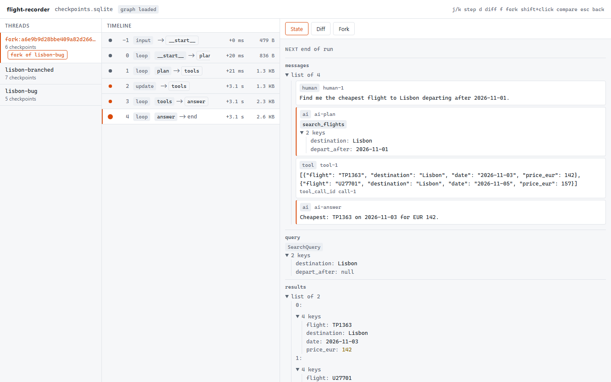
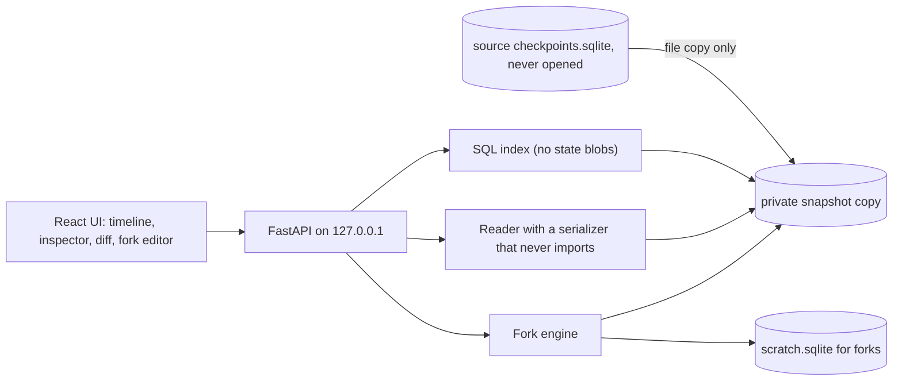

# ⏪ flight-recorder

> Time-travel debugger for LangGraph. Step through checkpoints, diff states, edit one and fork the run.

**flight-recorder opens a 10,000-checkpoint LangGraph thread in 372.3 ms, steps between checkpoints in 33.1 ms, and forks any step without changing a byte of the original.**

<!-- readme-header -->
[](https://github.com/sathwikbairaboina2/flight-recorder/actions/workflows/ci.yml)    

| Measured | Source |
|---|---|
| **10k checkpoints in 372 ms** | `bench/results/ui.json` |



A local time-travel debugger for LangGraph SQLite checkpoints. Step through a run, diff any two states, edit a state and fork from it. Your original database is never opened by SQLite, so it cannot change.

## Try it in 30 seconds

flight-recorder is not on PyPI yet. Build the wheel and install it:

```bash
pnpm -C ui install && pnpm -C ui build   # the wheel serves the UI only if this ran first
uv build
uv tool install dist/langgraph_flight_recorder-0.1.0-py3-none-any.whl   # or: pipx install <wheel>
flight-recorder demo
```

The demo agent is asked for the cheapest flight to Lisbon after 2026-11-01. Its fake model drops the date, so it answers with an October flight. Press `k` twice to reach the `plan` step, press `d` to see the diff, press `f`, change `"depart_after": null` to `"2026-11-01"`, click Run fork, then Open fork. The fork answers `TP1363 on 2026-11-03`.

## Use it on your agent

```bash
flight-recorder serve --db path/to/checkpoints.sqlite --graph your_module:graph
```

`--graph` is only needed to fork. Reading never imports your code. Forking does, because it has to run your nodes. Run `flight-recorder doctor --db path/to/checkpoints.sqlite` to see what the reader finds.

## What it guarantees

| # | Guarantee | Proof |
|---|---|---|
| 1 | The source file and its folder are unchanged by reads and forks. | `tests/test_immutability.py` compares the SHA-256 of every file in the source folder before and after, including with a live writer holding an un-checkpointed WAL. CI runs it on ubuntu and windows. |
| 2 | Fork thread ids never equal a source thread id. | `tests/test_fork.py::test_fork_thread_namespace` |
| 3 | `diff(a, a)` is empty and `apply(a, diff(a, b))` equals `b`. | `ui/src/lib/diff.property.test.ts` |
| 4 | Reordering a list of messages gives only move operations. | `ui/src/lib/diff.test.ts` |
| 5 | Decoding never drops a value. | `tests/test_bridge.py` |
| 6 | Parent links and next nodes match LangGraph's own history. | `tests/test_index.py` |
| 7 | Local only. The server binds 127.0.0.1 and Docker publishes on loopback. | `tests/test_cli.py`, `tests/test_compose.py` |
| 8 | Reading never imports modules named in the database. | `tests/test_decode.py::test_reading_never_imports` |

## Benchmarks

Measured on a generated 10,000-checkpoint thread. The numbers below are copied from `bench/results/*.json`.

| Measure | Result | Source |
|---|---|---|
| Open the thread in the browser, cold (first load, builds the index) | 1911.8 ms | `ui.json` |
| Open the thread in the browser, warm median of 5 | 372.3 ms | `ui.json` |
| Step to the next checkpoint, median of 50 | 33.1 ms | `ui.json` |
| Step to the next checkpoint, p95 | 52.4 ms | `ui.json` |
| Index of 10,000 checkpoints, cold | 1041.8 ms | `api.json` |
| Index of 10,000 checkpoints, warm p50 | 61.0 ms | `api.json` |
| Load one checkpoint state, p50 | 9.2 ms | `api.json` |
| Fork round trip, p50 of 5 | 103.5 ms | `api.json` |
| Diff two states of 1066697 bytes, p50 | 5.4 ms | `diff.json` |
| Diff two states of 1066697 bytes, p95 | 97.2 ms | `diff.json` |

Machine: AMD Ryzen 9 7900X (24 threads), Windows 11, Python 3.12.10, Node v24.18.0, chromium 153.0.8010.12, langgraph 1.2.12. The source folder was byte-identical after the API benchmark (`"source_unchanged": true`). Step times include up to one animation frame of measurement granularity. The diff p95 is a single slow run among 30 and is probably garbage collection, so read the p50.

Reproduce:

```bash
uv run python bench/bench.py        # api.json, needs port 5323
pnpm -C ui bench:diff               # diff.json
pnpm -C ui perf                     # ui.json, needs port 5325
uv run python bench/headline.py --check README.md
```

## How it works



The sidecar copies your database (and its WAL) into a temp folder and reads the copy. The index comes from SQL over the checkpoints table. Full states are decoded without importing anything, then turned into tagged JSON. A fork copies the ancestor chain into a scratch database, applies your edit with `update_state`, and streams the rest of the run using your graph.

## Decisions and trade-offs

| ADR | Decision | What it gave up |
|---|---|---|
| [0001](docs/adr/0001-snapshot-copy-of-source.md) | Read a private copy, never the source | Time and disk on huge files, and a torn read is possible if a writer commits mid-copy |
| [0002](docs/adr/0002-safe-decoder-never-imports.md) | Decode without importing | Depends on LangGraph's extension code numbers |
| [0003](docs/adr/0003-sql-metadata-index.md) | Index with SQL | Coupled to the SqliteSaver table layout |
| [0004](docs/adr/0004-synchronous-fork-response.md) | Forks return all events in one response | No live progress for slow forks |
| [0005](docs/adr/0005-ephemeral-scratch-forks.md) | Forks live in a scratch database | Forks are lost on exit unless `--scratch` is set |
| [0006](docs/adr/0006-tagged-json-and-own-diff.md) | Own diff keyed by message id | Not the minimal set of moves |
| [0007](docs/adr/0007-local-only-and-ports.md) | Loopback only, port 5320 | No auth and no remote use |
| [0008](docs/adr/0008-toolchain-and-v01-scope.md) | Narrow v0.1 scope | No graph view yet |

## Limits (v0.1)

- SQLite only. No Postgres.
- No live streaming of fork progress (no SSE).
- No graph view, no export.
- No forks inside subgraphs.
- `builder.compile` drops compile options set on your compiled graph.
- Not on PyPI yet.

## Development

```bash
uv sync
uv run ruff check . && uv run ruff format --check .
uv run pytest -q
pnpm -C ui install
pnpm -C ui typecheck && pnpm -C ui test
pnpm -C ui build          # writes src/flight_recorder/static
pnpm -C ui e2e            # Playwright on port 5322
docker compose up -d      # demo on http://127.0.0.1:5324
```
