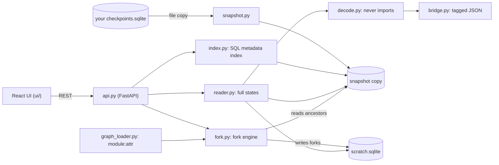

# flight-recorder developer guide

## 1. What it is

flight-recorder is a local time-travel debugger for LangGraph SQLite checkpoints.
You can step through a run, diff any two states, edit a state and fork from it.
It never writes to your database. SQLite opens a copy, never the original.

**Headline (measured):** on a 10,000-checkpoint thread it opens in 372.3 ms (warm median of 5) and steps between checkpoints in 33.1 ms (median of 50). The source folder is byte-identical after reads and forks.
The numbers are in `bench/results/ui.json` and `bench/results/api.json`. `bench/headline.py --check README.md` fails if the README stops matching them.

## 2. Quickstart (5 minutes)

You need Python 3.12, `uv`, Node 24 and `pnpm` (through `corepack enable`).

Run from source:

```bash
uv sync
pnpm -C ui install
pnpm -C ui build          # writes the UI into src/flight_recorder/static/
uv run flight-recorder demo
```

Open http://127.0.0.1:5320/. The demo agent drops a date filter and recommends an October flight.
Press `k` twice to reach the `plan` step. Press `d` to see the diff. Press `f`.
Change `"depart_after": null` to `"2026-11-01"`. Click Run fork, then Open fork.
The fork answers `TP1363 on 2026-11-03`.

Build and install the wheel:

```bash
pnpm -C ui install && pnpm -C ui build   # do this first, or the wheel has no UI
uv build
uv tool install dist/langgraph_flight_recorder-0.1.0-py3-none-any.whl
flight-recorder demo
```

If the UI is missing, `serve` and `demo` print `warning: no UI at ...` and serve only the API.

Debug your own agent:

```bash
flight-recorder serve --db path/to/checkpoints.sqlite --graph your_module:graph
flight-recorder doctor --db path/to/checkpoints.sqlite
```

`--graph` is needed only to fork. Reading never imports your code. Forking does, because it runs your nodes.

## 3. Architecture

The server copies the source database (and its WAL) into a temp folder. Everything reads that copy.
A SQL index lists threads and checkpoints from metadata only. The reader decodes full states with a decoder that never imports modules.
Forks rebuild the chain of ancestors in a separate scratch database, then run your graph there.



## 4. Project layout

| Path | What it holds |
|---|---|
| `src/flight_recorder/snapshot.py` | Copies the source database and WAL; refreshes on change |
| `src/flight_recorder/index.py` | Thread and checkpoint list from SQL metadata |
| `src/flight_recorder/decode.py`, `bridge.py` | Safe msgpack decoder and the tagged JSON format |
| `src/flight_recorder/reader.py` | Full states from the snapshot and the scratch database |
| `src/flight_recorder/fork.py`, `scratch.py` | Fork engine and the scratch database with fork provenance |
| `src/flight_recorder/graph_loader.py` | Loads `module:attr` graphs and builds an explicit msgpack allow list |
| `src/flight_recorder/api.py`, `cli.py` | REST API and the `serve`, `demo`, `doctor` commands |
| `src/flight_recorder/samples.py` | The buggy flight-search agent and sample database generator |
| `src/flight_recorder/static/` | Built UI. Gitignored. Bundled into the wheel only if built first |
| `tests/` | pytest, one file per module, plus immutability and compose checks |
| `ui/src/` | React app; pure helpers (diff, lanes, tags, format) in `ui/src/lib/` |
| `ui/e2e/` | Playwright flow test and perf test |
| `bench/` | API benchmark, headline builder and committed results |
| `docs/adr/` | Eight decision records |
| `docs/superpowers/` | Spec and plan |
| `Dockerfile`, `docker-compose.yml` | Demo image, published on 127.0.0.1:5324 |
| `.github/workflows/ci.yml` | Jobs: python (ubuntu, windows), ui (with e2e), wheel, docker |

## 5. Run, test and benchmark

```bash
uv run ruff check . && uv run ruff format --check .
uv run pytest -q                                   # 74 tests
pnpm -C ui typecheck && pnpm -C ui test            # 48 tests
pnpm -C ui build
pnpm -C ui e2e                                     # port 5322, 2 tests
uv run python bench/bench.py                       # port 5323, writes bench/results/api.json
pnpm -C ui bench:diff                              # writes bench/results/diff.json
pnpm -C ui perf                                    # port 5325, writes bench/results/ui.json
uv run python bench/headline.py --check README.md
docker compose build && docker compose up -d       # http://127.0.0.1:5324/
docker compose down
```

Ports used: 5320 (default serve), 5322 (e2e), 5323 (bench), 5324 (Docker), 5325 (perf).

## 6. Key decisions and what they gave up

- [ADR 0001](adr/0001-snapshot-copy-of-source.md): read a copy of the source. Costs time and disk on huge files.
- [ADR 0002](adr/0002-safe-decoder-never-imports.md): decode without importing. Depends on LangGraph's msgpack extension codes.
- [ADR 0003](adr/0003-sql-metadata-index.md): index with SQL. Coupled to the SqliteSaver table layout.
- [ADR 0004](adr/0004-synchronous-fork-response.md): a fork answers in one response. No live progress.
- [ADR 0005](adr/0005-ephemeral-scratch-forks.md): forks live in a scratch database. Lost on exit unless you pass `--scratch`.
- [ADR 0006](adr/0006-tagged-json-and-own-diff.md): own diff keyed by message id. Not a minimal edit script.
- [ADR 0007](adr/0007-local-only-and-ports.md): loopback only. No auth.
- [ADR 0008](adr/0008-toolchain-and-v01-scope.md): narrow v0.1 scope. No graph view yet.

## 7. Known limits and what is left

- SQLite checkpoints only. Postgres is not supported.
- No live fork progress (SSE), no graph view, no export, no forks inside subgraphs. These are the v0.2 list.
- `builder.compile` drops compile options set on your compiled graph.
- Not on PyPI. You build the wheel yourself, and the UI must be built first.
- CI was checked with actionlint but has never run, because the repo has no remote yet.
- On the build machine, Windows Application Control blocked the freshly created `flight-recorder.exe` launcher. `python -m flight_recorder` works there. The CI wheel job runs the launcher on ubuntu.
