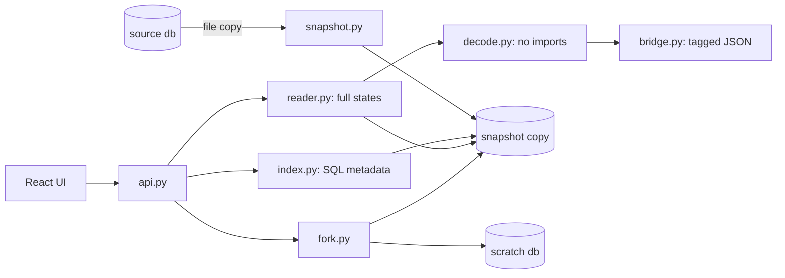

# flight-recorder developer guide

## What it is

A local time-travel debugger for LangGraph SQLite checkpoints. It steps, diffs and forks a run without touching the original database.

Headline, measured on a 10,000-checkpoint thread: it opens in 372.3 ms (warm median), steps between checkpoints in 33.1 ms (median), and the source folder stays byte-identical after forks. Numbers come from `bench/results/*.json`.

## Quickstart (5 minutes)

```bash
uv sync
pnpm -C ui install
pnpm -C ui build
uv run flight-recorder demo
```

Open http://127.0.0.1:5320/. Press `k` twice, `d`, `f`, change `depart_after` to `2026-11-01`, Run fork, Open fork.

To debug your own agent:

```bash
uv run flight-recorder serve --db path/to/checkpoints.sqlite --graph your_module:graph
```

## Architecture



## Project layout

| Path | What it holds |
|---|---|
| `src/flight_recorder/` | Python package: snapshot, index, decode, bridge, reader, fork, api, cli, samples |
| `src/flight_recorder/static/` | Built UI (gitignored, bundled into the wheel) |
| `tests/` | pytest: one file per module, plus immutability and compose checks |
| `ui/src/` | React app, components and pure helpers in `lib/` |
| `ui/e2e/` | Playwright flow test and perf test |
| `bench/` | API benchmark, headline builder, committed results |
| `docs/adr/` | Eight decision records |
| `docs/superpowers/` | Spec and plan |
| `Dockerfile`, `docker-compose.yml` | Demo image, published on 127.0.0.1:5324 |

## Run, test and benchmark

```bash
uv run ruff check . && uv run ruff format --check .
uv run pytest -q
pnpm -C ui typecheck && pnpm -C ui test
pnpm -C ui build
pnpm -C ui e2e                       # port 5322
uv run python bench/bench.py         # port 5323
pnpm -C ui bench:diff
pnpm -C ui perf                      # port 5325
uv run python bench/headline.py --check README.md
docker compose build && docker compose up -d   # port 5324
docker compose down
```

## Key decisions and what they gave up

- [ADR 0001](adr/0001-snapshot-copy-of-source.md): read a copy. Gives up time and disk on huge files.
- [ADR 0002](adr/0002-safe-decoder-never-imports.md): decode without importing. Depends on LangGraph's extension codes.
- [ADR 0003](adr/0003-sql-metadata-index.md): index with SQL. Coupled to the SqliteSaver tables.
- [ADR 0004](adr/0004-synchronous-fork-response.md): forks answer in one response. No live progress.
- [ADR 0005](adr/0005-ephemeral-scratch-forks.md): forks live in a scratch database. Lost on exit unless `--scratch`.
- [ADR 0006](adr/0006-tagged-json-and-own-diff.md): own diff keyed by message id. Not minimal moves.
- [ADR 0007](adr/0007-local-only-and-ports.md): loopback only. No auth.
- [ADR 0008](adr/0008-toolchain-and-v01-scope.md): narrow scope. No graph view yet.

## Known limits and what is left

- SQLite only. SSE, graph view, export, Postgres and subgraph forks are the v0.2 list.
- Not published on PyPI.
- CI was linted with actionlint but has not run, because there is no remote.
- The Windows Application Control policy on the build machine blocked a freshly created launcher exe, so the fresh-venv version check used `python -m flight_recorder --version`.
