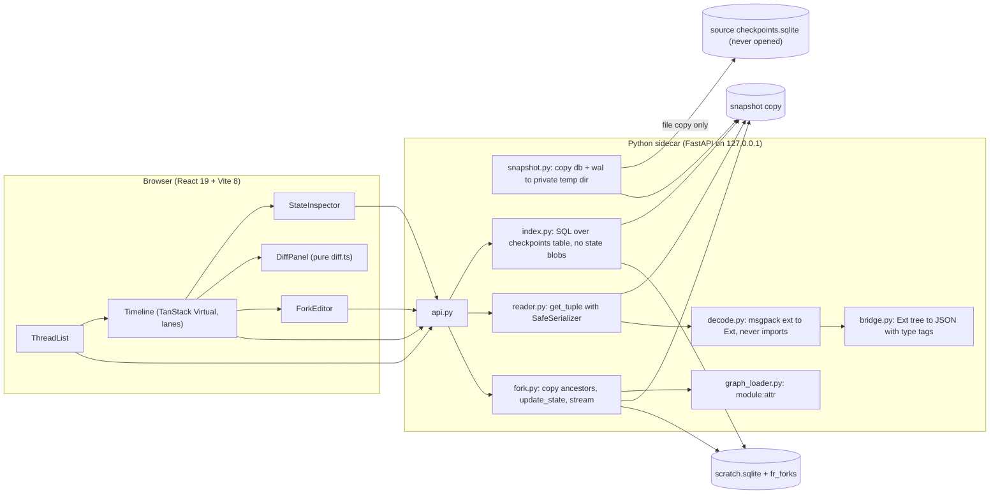

# Flight recorder v0.1 spec (2026-10-04)

Source design: `C:\Users\sathwik\projects\taskarinchu\docs\devdocs\flight-recorder.md`.
Portfolio bar: `C:\Users\sathwik\projects\taskarinchu\docs\superpowers\specs\2026-10-03-project-shortlist.md`
(30-second wow, measured headline number, something installable, honest ADRs, CI with tests).

## One line

A local time-travel debugger for LangGraph: point it at a SQLite checkpoint file, step through every
checkpoint, diff state between any two, and fork a run from any step into a scratch database while the
original file stays byte-for-byte unchanged.

## Who and why

LangGraph developers whose agent goes wrong on step 14 of 30. Today they print state or open the SQLite
file by hand. LangGraph Studio needs the LangGraph server. This tool needs only the checkpoint file
(and the graph module, if you want to fork).

## The 30-second wow

```text
pipx install ./dist/langgraph_flight_recorder-0.1.0-py3-none-any.whl   # or: uvx --from <wheel> flight-recorder demo
flight-recorder demo
```

`demo` writes a sample database (a small "flight search" agent that drops the user's date filter, a
deterministic fake model, no network), starts the server on `127.0.0.1:5320` and opens the browser.
The user presses `j` to step, `d` to see the diff where the date filter vanished, `f` to fork from that
step with the filter restored, and sees the fork reach a different answer. The README shows a real
screenshot of that flow, captured by the Playwright e2e test.

## Scope decisions (v0.1)

In:
- Read path: thread list, checkpoint index (metadata only), full state for one checkpoint, subgraph
  namespaces listed (root namespace browsable).
- Fork path: fork from any root-namespace checkpoint with edited top-level values and an `as_node`,
  run to completion or interrupt synchronously, show the forked thread as its own timeline.
- UI: thread list, virtualized timeline with branch lanes, message-aware state inspector, diff panel,
  fork editor, keyboard model `j`/`k`/`d`/`f`/`Escape`, shift+click to diff any two checkpoints.
- CLI: `serve`, `demo`, `doctor`, `--version`.
- Installable wheel with the built UI inside. Docker image and compose demo.
- Headline benchmark on a generated 10,000-checkpoint thread.

Moved to v0.2 (recorded in ADRs, not silently dropped): SSE streaming of fork events (v0.1 returns all
events in the POST response), graph view with React Flow, single-file HTML export, Postgres, forking
inside subgraph namespaces, `[`/`]` branch jumps.

## Architecture



Key differences from the design doc, each with an ADR:
- The source file is never opened by SQLite at all. A `mode=ro` open of a WAL database creates `-wal`
  and `-shm` files next to it (prototyped 2026-10-04), which breaks "byte-for-byte unchanged". The
  sidecar copies the database and its `-wal` file into a private temp dir and reads the copy
  (ADR 0001).
- The read path never imports modules named inside the database. LangGraph's default deserializer
  imports `module.Class` from the checkpoint and, when the import fails, turns a dataclass into `None`
  (prototyped). Our `SafeSerializer` decodes every msgpack extension into an inert `Ext` record, so
  reading is safe on untrusted files and nothing is silently dropped (ADR 0002).
- The metadata index reads the `checkpoints` table with SQL (ids, parent id, metadata JSON, blob
  length) and decodes each blob only shallowly for `updated_channels`. The official
  `list()` takes 3.6 s for 10,000 checkpoints (full decode plus one writes query per row); the SQL index
  took about 0.3 s in the prototype. Full state still goes through `get_tuple` (ADR 0003).
- Fork events come back in the POST response, not over SSE (ADR 0004).

## Data contracts

### Bridged JSON (Python `bridge.to_json`, consumed by the UI)

JSON primitives pass through. Lists and tuples become arrays. Dicts with only string keys and no
reserved key become objects. Everything else becomes a tagged object. Reserved tag keys:

| Tag | Shape | From |
|---|---|---|
| `__lc_message__` | `{"__lc_message__": "ai", "id": "...", "content": ..., "tool_calls": [...], ...all fields}` | pydantic ext whose type starts with `langchain_core.messages.` |
| `__pydantic__` | `{"__pydantic__": "mod.Name", "fields": {...}}` | other pydantic v1/v2 ext |
| `__object__` | `{"__object__": "mod.Name", "fields": {...}}` or `{"__object__": "mod.Name", "args": [...]}` | kw / pos / generic single-arg ext (dataclasses, namedtuples, enums) |
| `__set__` | `{"__set__": [...]}` | `builtins.set`, `builtins.frozenset` |
| `__bytes__` | `{"__bytes__": "<base64>"}` | `bytes`, `bytearray` |
| `__datetime__`, `__date__`, `__time__` | `{"__datetime__": "<iso>"}` | method ext `datetime.*.fromisoformat` |
| `__uuid__` | `{"__uuid__": "8-4-4-4-12"}` | `uuid.UUID` |
| `__decimal__` | `{"__decimal__": "1.5"}` | `decimal.Decimal` |
| `__float__` | `{"__float__": "nan" \| "inf" \| "-inf"}` | non-finite floats |
| `__map__` | `{"__map__": [[k, v], ...]}` | dicts with a non-string key or a reserved key |
| `__unrepresentable__` | `{"__unrepresentable__": "<kind or type>", "repr": "<= 2000 chars"}` | numpy, delta snapshots, unknown ext codes, any other Python object |

`bridge.from_json` is the inverse used only by the fork engine (user code is loaded there): it
rebuilds messages with `langchain_core.messages.messages_from_dict`-compatible dicts, pydantic
objects by importing the named class, and the scalar tags. `__unrepresentable__` raises `ValueError`.

### REST (all under `/api`, server binds `127.0.0.1`)

| Method | Path | Response |
|---|---|---|
| GET | `/health` | `{"ok": true, "version": "0.1.0", "graph": bool, "source": "<file name>"}` |
| GET | `/threads` | `[{thread_id, origin, checkpoint_count, first_at, last_at, namespaces, fork_of}]` newest `last_at` first |
| GET | `/threads/{tid}/checkpoints?ns=` | `[{checkpoint_id, parent_id, step, source, next, writes_from, created_at, state_bytes, origin}]` oldest first |
| GET | `/threads/{tid}/checkpoints/{cid}?ns=` | `{checkpoint_id, values, next, pending_writes: [{task_id, channel, value}], metadata}` |
| GET | `/graph` | `{nodes: [str], edges: [{source, target, conditional}]}`; 404 without `--graph` |
| POST | `/forks` | body `{thread_id, checkpoint_id, values, as_node}`; returns `{fork_id, thread_id, base_checkpoint_id, head_checkpoint_id, status, events, error, elapsed_ms}`; 400 without `--graph`, 404 unknown checkpoint, 422 bad values |

`created_at` comes from the uuid6 timestamp in `checkpoint_id` (prototype: within 0.6 ms of
`checkpoint.ts`, which LangGraph reads from a separate clock call; tests allow 5 ms).
`next` is the sorted node names `n` for which `branch:to:n` is in the checkpoint's `updated_channels`,
plus `__start__` when `__start__` is in it. `update_state` checkpoints store no `updated_channels`; for
them the channels whose version differs from the parent's `channel_versions` are used instead.
`writes_from` is the sorted node names whose `versions_seen` entry changed since the parent, without
`__input__` and `__interrupt__` (empty for the root and for `update` checkpoints).
Prototype on 2026-10-04: `next` and `parent_id` equal `get_state_history` for every checkpoint of the
sample threads, the update branch and a fork. `state_bytes` is `length(checkpoint)` of the stored blob.

### Scratch database

Created by `SqliteSaver.setup()` plus:

```sql
CREATE TABLE IF NOT EXISTS fr_forks (
  fork_id TEXT PRIMARY KEY, source_db_sha256 TEXT NOT NULL, source_thread_id TEXT NOT NULL,
  source_checkpoint_id TEXT NOT NULL, scratch_thread_id TEXT NOT NULL UNIQUE, as_node TEXT,
  values_json TEXT NOT NULL, created_at TEXT NOT NULL
);
```

Fork thread ids are `fork:<uuid4 hex>`, regenerated on the (astronomically unlikely) clash with a
source thread id. Only the ancestor chain of the chosen checkpoint is copied (oldest first, with its
pending writes). The default scratch file lives in a fresh temp dir removed on exit; `--scratch PATH`
keeps it.

## Invariants and the tests that prove them

| # | Invariant | Test |
|---|---|---|
| 1 | The source file and its directory are unchanged by reads and forks. | `tests/test_immutability.py`: SHA-256 of every file in the source dir plus the file list, before and after reading every checkpoint of every thread and running 5 forks; also with a live writer holding an un-checkpointed `-wal`. Runs on ubuntu and windows in CI. |
| 2 | Fork thread ids never equal a source thread id. | `tests/test_fork.py::test_fork_thread_namespace` (hypothesis over source id sets including `fork:` ids and a forced clash). |
| 3 | `diff(a, a)` is empty and `apply(a, diff(a, b))` equals `b`. | `ui/src/lib/diff.property.test.ts` (fast-check, 500 runs). |
| 4 | Reordering a keyed list produces only `move` ops. | `ui/src/lib/diff.test.ts`. |
| 5 | No value is silently dropped by decode + bridge. | `tests/test_bridge.py` fixtures (messages, pydantic, dataclass from an unimportable module, set, bytes, datetime, uuid, decimal, tuple, nan, non-str keys, reserved keys) and a hypothesis round trip `from_json(to_json(x)) == x`. |
| 6 | Parent links match LangGraph. | `tests/test_index.py::test_parent_links_match_state_history` (branch created with `update_state`). |
| 7 | Local only. | `tests/test_cli.py`: default host `127.0.0.1`; `--host 0.0.0.0` exits 2 without `--i-know-this-is-unauthenticated`; `tests/test_compose.py` fails on any published port without `127.0.0.1`. |
| 8 | Reading never imports user modules. | `tests/test_decode.py::test_reading_never_imports`: a canary module on `sys.path` whose import writes a file; reading the DB must not create it nor add it to `sys.modules`. |

## Headline number

Measured by `bench/bench.py` and `ui/e2e/perf.spec.ts` on a generated 10,000-checkpoint thread, written
to `bench/results/latest.json` with the machine line. The README's first line quotes the UI number
("opens a 10,000-checkpoint thread in N ms") if the Playwright run succeeded, otherwise the API number,
and always the immutability result ("0 bytes changed in the source after 5 forks"). Numbers are never
typed by hand.

## Ports and names (session isolation)

| Use | Port |
|---|---|
| `flight-recorder serve` / `demo` default | 5320 |
| Vite dev server (proxies `/api` to 5320) | 5321 |
| Playwright e2e server | 5322 |
| API bench server | 5323 |
| Docker compose demo (host side) | 5324 |
| Playwright UI perf server (10k thread) | 5325 |

Docker image `flight-recorder:dev`, compose project `flight-recorder`, container `flight-recorder-demo`.

## Toolchain (verified 2026-10-04)

Host: Python 3.12.10, uv 0.12.21, Node 24.18.0, pnpm 9.12.0, Docker 29.5.3, Playwright Chromium already
installed for `@playwright/test` 1.63.

Python: langgraph 1.2.12, langgraph-checkpoint 4.2.0, langgraph-checkpoint-sqlite 3.1.1,
langchain-core 1.6.6, ormsgpack 1.12.2, fastapi 0.142.2, uvicorn 0.54.0, hatchling 1.32.4;
dev: pytest 9.1.1, httpx 0.28.1, hypothesis 6.168.3, ruff 0.16.10.

UI: react / react-dom 19.3.0, vite 8.3.2, @vitejs/plugin-react 6.1.1, typescript 7.0.2, vitest 5.0.3,
fast-check 4.10.2, @tanstack/react-virtual 3.14.13, @testing-library/react 16.3.3,
@testing-library/user-event 14.6.7, jsdom 30.1.1, @playwright/test 1.63.0, @types/react(-dom) 19.3.0,
@types/node 26.6.4.

## Non-goals (v0.1)

Tracing backend, hosted service, auth, writing back to the source database, JavaScript LangGraph,
Postgres, editing subgraph state.
